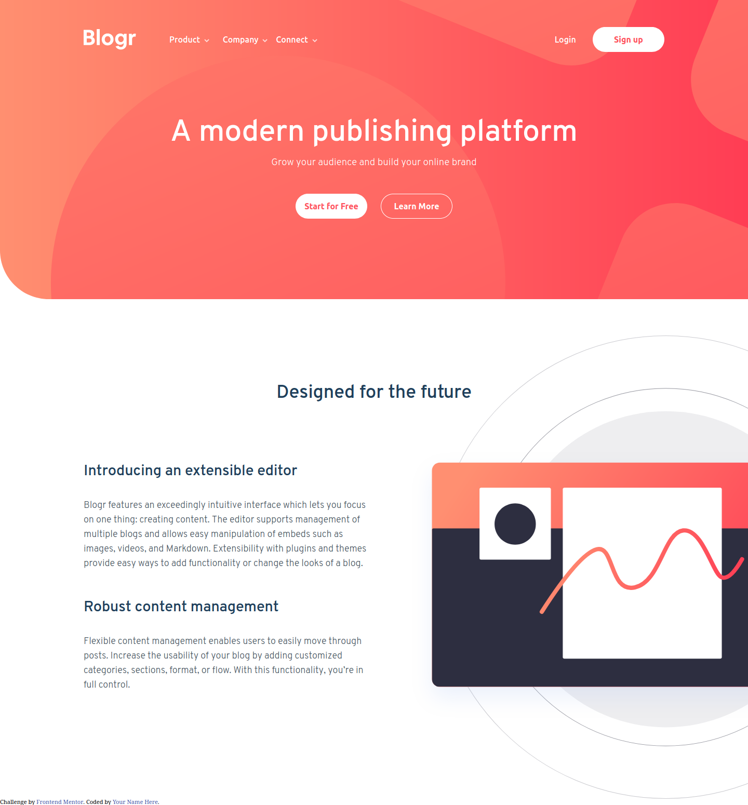

# Frontend Mentor - Blogr landing page solution

This is a solution to the [Blogr landing page challenge on Frontend Mentor](https://www.frontendmentor.io/challenges/blogr-landing-page-EX2RLAApP).

## Table of contents

- [Overview](#overview)
  - [The challenge](#the-challenge)
  - [Screenshot](#screenshot)
  - [Links](#links)
- [My process](#my-process)
  - [Built with](#built-with)
  - [What I learned](#what-i-learned)
  - [Continued development](#continued-development)
  - [Useful resources](#useful-resources)
- [Author](#author)

## Overview

### The challenge

Users should be able to:

- View the optimal layout for the site depending on their device's screen size
- See hover states for all interactive elements on the page

### Screenshot

### Links

- Solution URL: [Solution in GithubPages](https://atlas6174.github.io/blogr-landing-page-main)

## My process

### Built with

- Semantic HTML5 markup
- CSS custom properties
- Flexbox
- Mobile-first workflow
- JavaScipt

### What I learned

Actually, I have learned a lot with this challenge. Firstly, the implementation from the
JavaScript in the navbar, accesing to the properties from the dropdowns objects. By the
way, it was new for me the use from the pageYOffSet property, which has been used to add
the behavior to the header, avoiding the transparence while scrolling the page.

This challenge was usefull to learn how to use the background-position property, and the
pseudo-elements.

Currently, I can't remember more stuffs, but I'll update this information in the near
future.

### Continued development

Currently, the behvior from the navbar is an click event (both mobile and desktop) but
in desktop, may be useful make it a hover event too. The issue is that if the user click
a dropdown and hover other, the dropdowns will overlap.

I would be very grateful for some feedback related to the page in general, but specialy
related to the navbar and header development and the organization from the whole scss.
I think that some comments in the code are needed, and maybe a restructuring from the
folders and modules distribution.

### Useful resources

The standar resources: Mozilla Developers, CSS Tricks, W3schools, stackoverflow, etc...
I haven't the exactly links I've use, but for th next challenges, this section will be
more complete.

## Author
I don't have webpage yet, nor twitter or another social media. But her you can find my
github and frontendmentor profiles:

- Frontend Mentor - [@@Atlas6174](https://www.frontendmentor.io/profile/Atlas6174)
- Github - [@Atlas6174](https://github.com/Atlas6174)
